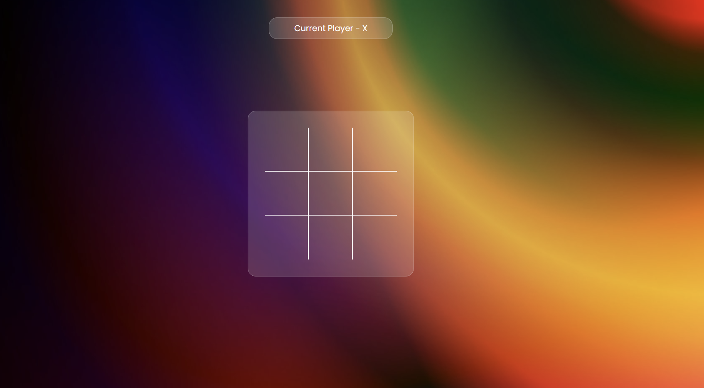

# ❌⭕ Tic Tac Toe Game

A classic **Tic Tac Toe** game built using **HTML**, **CSS**, and **JavaScript**. Challenge your friends in a responsive and cleanly designed browser game!

# Demo

You can view the live demo [here](https://tic-tac-toe-three-lac-50.vercel.app/).

## 🎮 Features

- ✅ Two-player game functionality
- 🧠 Intelligent turn-based logic
- 🎨 Simple and modern UI using pure CSS
- 💻 Fully responsive design
- 🔄 Reset game functionality

## 🖼️ Screenshots

 

## 🛠️ Tech Stack

- HTML5
- CSS3
- JavaScript (Vanilla)

## 📁 Project Structure

```
tictactoe-game/
├── index.html
├── styles.css
├── script.js
└── assets/

```

## ⚙️ Setup Instructions

1. Clone this repository:
   ```bash
   git clone https://github.com/Amarsah15/TIc-Tac-Toe.git
   cd tictactoe-game
   ```

2. Open `index.html` in your browser to start playing.

## ✨ Author

- Made with ❤️ by [Amarnath Kumar](https://github.com/Amarsah15)

---
Enjoy the game and happy coding!
